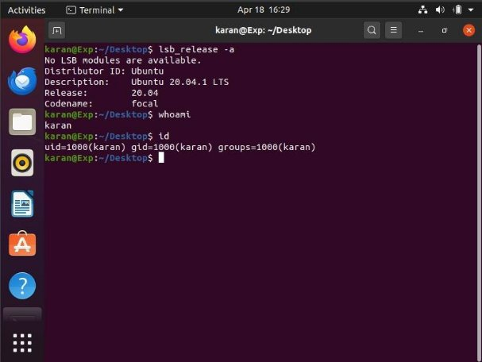
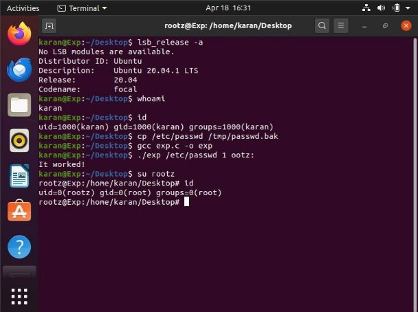

CSE 5380: Information Security Paper **CVE-2022-0847 (Dirty Pipe)** 

By 

Karan Vasudevamurthy (UTA ID: 1002164438) 

**What is CVE?** 

Common  Vulnerabilities  and  Exposures  (CVE)  is  a  list  of  publicly  disclosed  information  security vulnerabilities and exposures. The MITRE corporation introduced CVE in 1999 to identify and classify the vulnerabilities in software and firmware. MITRE is a nonprofit that operates federally funded research and development centers in the United States. CVE aims to facilitate the sharing of information about known vulnerabilities so that cybersecurity plans may be updated to reflect the most recent security issues and weaknesses. In order to do this, CVE assigns a unique identifier to each vulnerability or exposure. Through CVE identifiers, which are also known as CVE names or CVE numbers. The Common Vulnerability Scoring System (CVSS) is a set of open standards for assigning a number to a vulnerability to assess its severity. The range of a CVSS score is 0.0 to 10.0. The degree of security severity increases with increasing number. Each CVE ID is formatted as CVE-YYYY-NNNNN. The YYYY portion is the year the CVE ID was assigned or the year the vulnerability was made public. 

**What are pipes?** 

Within the context of CVE-2022-0847, it's crucial to understand the internal workings of pipes, particularly the attributes associated with the pipe buffer. Pipes in Linux help in transferring data between processes, with the output of one process becoming the input for another. This mechanism facilitates communication and coordination between different processes running on the system. Pipes are unidirectional in Linux, meaning that data flows in only one direction. A pipe buffer typically consists of a fixed-size, first-in-first-out (FIFO) data structure that temporarily holds the data being transferred between processes. When a process writes data to a pipe, it is stored in the buffer until another process reads from it. Once the data is read, it is removed from the buffer, allowing new data to be written. 

**The vulnerability** 

For CVE-2022-0847, it is important to understand two functions within the pipe buffer-  

1. copy\_page\_to\_iter\_pipe: This function is responsible for copying data from a page to an iterator associated with a pipe buffer. In the context of inter-process communication via pipes, when one process writes data to a pipe, it needs to be copied to the pipe buffer so that it can be read by another process. The "copy\_page\_to\_iter\_pipe" function facilitates this copying process, ensuring that data is transferred correctly and efficiently between processes. Within this function, the "flags" parameter is utilized to specify or control certain attributes or behaviors related to the copying process. These flags may include options such as whether to perform additional checks or validations, how to handle specific types of data, or whether to apply optimizations for efficiency. 
1. push\_pipe: The "push\_pipe" function is involved in pushing data into the pipe buffer. When a process writes data to a pipe, the data needs to be inserted into the pipe buffer, where it can then be read by another process. The "push\_pipe" function is responsible for handling this insertion process, ensuring that data is correctly placed into the buffer and made available for reading by other processes. 

Page | 1  

Max Kellermann discovered that the Linux kernel incorrectly handled Unix pipes. The vulnerability arises due  to  inadequate  initialization  of  certain  attributes,  specifically  the  "flags"  parameter,  within  the "copy\_page\_to\_iter\_pipe" and "push\_pipe" functions. This oversight leads to the possibility of stale or incorrect values being assigned to the flags, potentially compromising the security and integrity of the system. An unprivileged local user could use this flaw to write to pages in the page cache backed by read- only files and, as such, escalate their privileges on the system. 

**Attack Methodology** 

It is similar to CVE-2016-5195 “Dirty Cow” but is easier to exploit. The exploitation of CVE-2022-0847 requires local access to the target system and affects Linux kernel versions newer than 5.8.  We can create new pipe  buffers  with  the  PIPE\_BUF\_FLAG\_CAN\_MERGE  flag  incorrectly  set  due  to  the  lack  of  proper initialization. This flag controls coalescing of writes into a pipe buffer and thus allows for writing to an existing page spliced into the pipe. Should a file allow this spliced page, the modification will be seen in the shared system-wide view of the file in  the memory. Any further cache flush will disregard the current  Linux permissions settings and copy the altered data to disc. This would enable an underprivileged user to change specific contents of a file (either on disc or in memory), even if the file is only protected from modification by  read-only  access  controls  like  SELinux,  standard  Linux  permissions,  advanced  access  control,  and immutable files. Hence we can assume that the attacker would be any underprivileged local user with basic knowledge of Linux systems and the capability to execute malicious code. Such an individual could escalate their privileges and potentially compromise the entire system, posing a significant security risk. 

**Proof of concept** 

Given below are the steps that I have followed to exploit CVE-2022-0847 on a virtual machine running Linux.  

1. **Checking if your Linux Distribution can be exploited-** 

   Any Linux Kernel newer than 5.8 is affected. However, versions 5.16.11, 5.15.25 and 5.10.102 cannot be exploited for CVE-2022-0847. To find your kernel version, we can simply run `*uname -r*`. You can also run this[ bash script ](https://github.com/basharkey/CVE-2022-0847-dirty-pipe-checker)if you are unsure if a target system is vulnerable or not. 

2. **Downloading the right Linux Kernel-**  

   For the demonstration I decided to use Ubuntu 20.04.1 LTS. But, this version of Ubuntu currently runs on Linux Kernel 5.15 and CVE-2022-0847 cannot be exploited on this version of the kernel.  To download Linux Kernel 5.8, we can simply run ` *sudo apt install linux-image-5.8.0-63-generic linux-headers-5.8.0-63-generic`* 

3. **Download the exploit-**  

   The exploit can be found on[ GitHub.](https://github.com/karanlvm/Infosec) It demonstrates how to overwrite any file contents in the page cache, even if the file is not permitted to be written, immutable or on a read-only mount. You could also run `*git clone[ https://github.com/karanlvm/Infosec.git`* ](https://github.com/karanlvm/Infosec.git%60)*in the terminal.  

4. **Copy the original passwd file-** 

   We can run `*cp /etc/passwd /tmp/passwd.bak*`. This will help us to identify the difference in the passwd file before and after running the exploit.  

5. **Compiling the exploit-**  

   In order to compile the exploit succesfully, you will need to have GCC installed. You can install GCC with ` *sudo apt-get install gcc*`. To compile the exploit you can run `*gcc exp.c -o exp*` 

6. **Running the exploit-**  

   To run the exploit, the parameters that need to be provided are the read-only file, the offset and some characters that are going to be inserted. In this case, we will run *`./exp /etc/passwd 1 ootz:* `. If you get an output that says “*It worked !*”, it means that we have successfully exploited the Dirty Pipe vulnerability and we can now get root access without the password.  

7. **Switch to root access-**  

   Now we can simply run `*su rootz*` and we should have root access. To confirm we can run the `id` command. 

**Limitations** 

There are two major limitations of this exploit: 

1. The offset cannot be on a page boundary (it needs to write at least one byte before the offset) 
1. The write cannot cross a page boundary. This means the payload must be less than the 4096 bytes (page size). 

**Current Status and Remediation** 

As of 2024-01-12, the probability of exploitation activity in the next 30 days is 7.58% (Exploit prediction scoring system (EPSS)). Given below is the CVSS (Common Vulnerability Scoring System) for CVE-2022-0487: 

This vulnerability can be exploited on any Linux kernel newer than 5.8. However, the vulnerability has been [fixed ](https://git.kernel.org/pub/scm/linux/kernel/git/torvalds/linux.git/commit/?id=9d2231c5d74e13b2a0546fee6737ee4446017903)in Linux 5.16.11, 5.15.25 and 5.10.102. Hence, we can just apply the patches or updates provided by Linux distribution maintainers to fix the vulnerability. In order to do this, we can just run the following 

commands `*sudo apt update*` and `*sudo apt upgrade*`.  

**References** 

1. *“2022-0847: A Flaw Was Found in the Way the ‘Flags’ Member of the New Pipe Buffer Structure Was Lacking Proper Initialization  in  Cop.”*  CVE  Details,  www.cvedetails.com/cve/CVE-2022-0847/. Accessed  24 Apr. 2024.  
1. Kellermann, Max. *“The Dirty Pipe Vulnerability.”* The Dirty Pipe Vulnerability - The Dirty Pipe Vulnerability Documentation, 7 Mar. 2022, dirtypipe.cm4all.com/.  
1. MITRE Corporation*. “CVE-2022-0847.”* CVE, 3 Mar. 2022, cve.mitre.org/cgi-bin/cvename.cgi?name=CVE- 2022-0847.  
1. National  Institute  of  Standards  and  Technology.”  *CVE-2022-0847*.”  NVD,  3  Oct.  2022, nvd.nist.gov/vuln/detail/cve-2022-0847.  
1. “*Piping in Unix or Linux*.” GeeksforGeeks, GeeksforGeeks, 5 July 2023, www.geeksforgeeks.org/piping-in- unix-or-linux/.
Page | 5 
